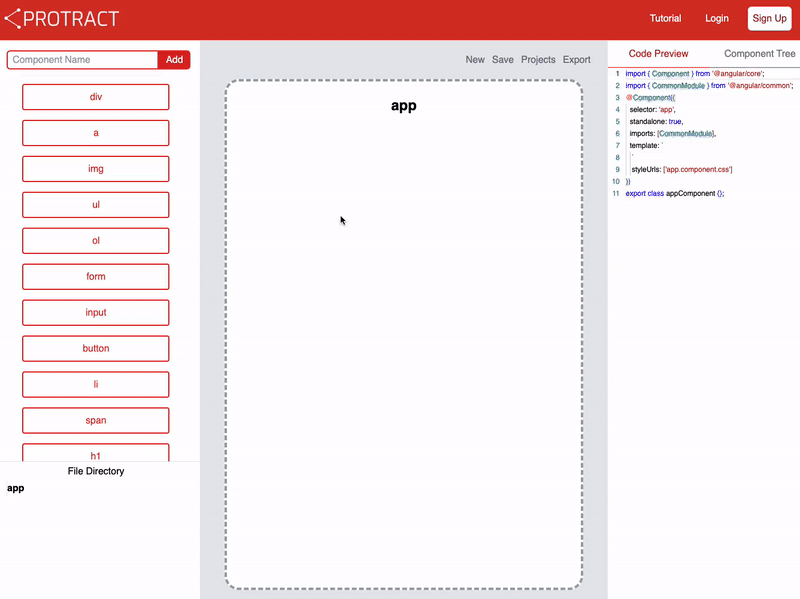

<br />
<div align="center">
  <a href="https://github.com/oslabs-beta/Protract">
    
  </a>

<h3 align="center">Protract</h3>

  <p align="center">
    <strong>Supercharge your Angular development process</strong>
    <br />
    <a href="https://protract.dev"><strong>Build Your Angular App »</strong></a>
    <br />
    <a href="https://github.com/oslabs-beta/Protract/issues">Report Bug</a>
    ·
    <a href="https://github.com/oslabs-beta/Protract/issues">Request Feature</a>
  </p>
</div>

<div align="center">


</div>

<details open>
  <summary>Table of Contents</summary>
  <ol>
    <li><a href="#about">About Protract</a></li>
       <li><a href="#features">Features</a></li>
    <li>
      <a href="#getting-started">Getting Started</a>
      <ul>
        <li><a href="#running-online">Running Online</a></li>
        <li><a href="#running-locally">Running Locally</a></li>
      </ul>
    </li>
    <li><a href="#run-exported-project">Run Exported Project</a></li>
    <li><a href="#contributions">Contributions</a></li>
    <li><a href="#contributors">Contributors</a></li>
    <li><a href="#license">License</a></li>
  </ol>
</details>

## <h1>About Protract</h1>

Protract is an accessible developer tool built from the ground up to assist with the blueprinting of Angular applications, simplifying the process of creating a hierarchy of components and allowing developers to quickly create the structure of their app so they can start coding faster.

[Here](https://medium.com/) is a medium article describing the philosophy behind Protract.

Visit our website at: https://Protract.dev


## <h1>Features</h1>

### ❗Drag and Drop
Drag and drop functionality to create and organize components
<br>
<br>

### ❗Custom Components
Custom components declared by the user
<p align="center">

</p>
<br>

### ❗Live Updates
Real-time visualization of code for each custom component, file structure of directory, and hierarchy of components
<p align="center">

</p>
<br>

### ❗Context Switch
Change current component canvas by clicking on the component in file directory or component tree
<br>
<br>

### ❗Cloud Storage
Create, save, load, and delete projects
<p align="center">

</p>
<br>

### ❗Easy Export
Export projects to use in a newly created Angular project
<p align="center">

</p>
<br>
<br>

### ❗Access Anywhere
In-browser functionality
<br>
<br>

## <h1>Getting Started</h1>

### <h2>Running Online</h2>

You can start using Protract by visiting the website at [protract-link].
To save and load projects you will need to make an account and login. Once your blueprint is completed you can hit the export button on the canvas.

### <h2>Running Locally</h2>
If you would like to run with Docker,

```
 docker pull protractors/protract-prod:latest
```

```
docker run -p <your-preferred-port>:3000 protractors/protract-prod
```

If you would like to use the app by forking and cloning:

Fork this repository to your own GitHub account.
Clone the forked repository to your machine

```
git clone https://github.com/<your-github-username>/protract.git
```

Create a .env in the root directory that contains 2 variables,

```
MONGO_URI=<your-mongo-uri>
mode=production
```

Navigate to the root project directory and install dependencies.

```
cd protract
npm install
```

If you would like to run in development mode, `npm run dev` and visit localhost:3000.

If you would like to run in production mode, `npm run build ` and then `npm start` and visit localhost:3000.

## <h1>Run Exported Project</h1>

In your terminal,

```
npm install -g @angular/cli
```

To install the Angular CLI if it has not already been installed.

```
ng new <your-project>
```

To start your new project.

In your file explorer, extract the zip file and replace the directory’s app folder with the one contained in the zip file.

## <h1>Contributions</h1>
We welcome contributions from the community. If you are interested in contributing to this project, please refer to our <a href="./contributing.md">Contributing Guidelines</a> for more information.


## <h1>Contributors</h1>


|     Developed By      |                                                                                                                                                         |                                                                                                                                                             |
| :-------------------: | :-----------------------------------------------------------------------------------------------------------------------------------------------------: | :---------------------------------------------------------------------------------------------------------------------------------------------------------: |
|    Don Do    |   [](https://github.com/Donlebon)    |         [](https://www.linkedin.com/in/)         |
|       Vander Harris       |      [](https://github.com/vdharris/)       |                             [](https://www.linkedin.com/in/vanderharris/)                              |
|  Peter Tran  |     [](https://github.com/tranpeter95)      |         [](https://www.linkedin.com/in/peter-tran-6574b81b9/)          |
|     Steven Vaughn    |     [](https://github.com/Svaughn4418)     |         [](https://www.linkedin.com/in/)         |
|      Douglas Yao      |      [](https://github.com/douglas-yao)      |          [](https://www.linkedin.com/in/douglas-yao/)          |

## <h1>License</h1>
<p>Protract is licensed under the terms of the <a href="./LICENSE">MIT license</a>.</p>

